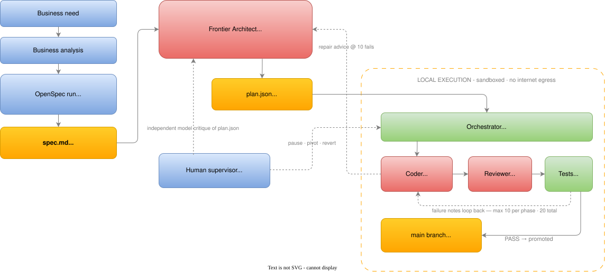

# 10/90 .NET – Spec-Driven Autonomous Framework for .NET

<p align="center">
  
</p>

*The diagram shows the implemented live sandbox boundary. Mock mode remains entirely in-process;
`sandbox.mode=unsafe-host` is an explicit compatibility opt-out.*

**By G. Paganelli - rift-demote-fence@duck.com**

**10/90 (tenninety)** is framework for software engineering teams building C# and .NET applications with local coding agents. It aims to provide substantial savings in development costs and time.

Preparation starts with people: a business need is identified, business analysis
clarifies it, and a business analyst–developer pair runs [OpenSpec](https://openspec.dev/) to turn
it into detailed requirements, consolidated into one `spec.md`.

From there AI takes over under supervision: an embedded *blueprint prompt* casts a high-reasoning
**frontier model** as Principal Architect, decomposing the spec into atomic work packages
(`plan.json`, strictly validated as a Directed Acyclic Graph a.k.a. DAG).

**Local models** then execute serially – a Coder (running inside [aider](https://aider.chat), [OpenCode](https://opencode.ai) or [Pi](https://pi.dev) – your choice via one config knob) builds on its own git branch, a Reviewer with a **different configured model identifier** judges the work against directives, and a mechanical test suite gates every promotion to `main` (roughly 10% of the intelligence budget spent on frontier reasoning, 90% on local inference). Operators must ensure those identifiers really resolve to different weights.

Every gate is mechanically enforced rather than requested: framework-built prompt text is sanitised, newly added secret-shaped files are kept out of commits, plans are re-validated after every change, every promotion lands as ONE squashed commit on `main`, and history is never rewritten. Humans stay in command through a real-time dashboard – pause, redirect (**pivot**: KEEP / REWORK / CANCEL), or revert a bad promotion.

> [!WARNING]
> **This is an experimental alpha.** Live Docker mode runs Coder, Reviewer exploration, Restore,
> and Tester commands in hardened disposable containers. The authoritative repository is never
> mounted; only an exact disposable candidate is writable. The host still controls Docker and the
> local Reviewer model transport, so use a least-privilege Docker deployment, digest-pinned role
> images, and keep credentials out of project files. `sandbox.mode=unsafe-host` deliberately gives
> up this isolation and is never an automatic fallback.

**Platform: .NET 10 (`net10.0`) with C# 14.** Built on the latest .NET release; C# 14 features (extension members, `field`-backed properties) are used where they clarify intent.

## Process model

The orchestrator is deliberately **waterfall**: once the plan is accepted, jobs are built in strict dependency order with no machine-decided scope drift. Changes stay **agile**: humans can introduce new or altered requirements at any stage – run them through OpenSpec, then trigger a pivot so every existing package is classified KEEP / REWORK / CANCEL and new work can be added. Completed work is normally classified KEEP.

Diagrams, design guarantees, the blueprint integration and the repository layout:
[`docs/OVERVIEW.md`](docs/OVERVIEW.md).

## Quickstart (offline simulation – no models required)

Where does `spec.md` come from? The recommended authoring pipeline is
**business need → business analysis → specification via [OpenSpec](https://openspec.dev/) → spec.md**
– see [`docs/SPEC-AUTHORING.md`](docs/SPEC-AUTHORING.md), which also recommends an
independent second-frontier-model review of the generated plan before you accept it.

All commands below are identical in **bash** and **fish** (fish 3+); no Windows shells are
supported or documented.

```bash
mkdir myproject && cd myproject
tenninety init                          # scaffolds .tenninety/, config, starter spec.md
$EDITOR spec.md                         # write your Business-Technical spec
tenninety plan --spec ./spec.md --yes   # Frontier decomposes → .tenninety/plan.json
tenninety start --headless              # autonomous serial execution of the whole queue
tenninety status                        # inspect queue & health
```

Out of the box `provider_mode` is `"mock"`: everything is simulated deterministically so the
whole pipeline runs offline. Live mode (`provider_mode = "aider"`) needs a coding agent – aider
by default, or OpenCode or Pi via the `coder_agent` knob – plus two different local models,
Docker, three digest-pinned role images, and a pre-existing internal model network. llama-swap
remains optional when the models share one GPU card. Details in
[`docs/OVERVIEW.md`](docs/OVERVIEW.md).

## Documentation

| Document | Audience |
| --- | --- |
| [`docs/OVERVIEW.md`](docs/OVERVIEW.md) | Everyone: how the framework works – execution model, distinct coder/reviewer requirement, aider, llama-swap, guarantees, repository layout |
| [`docs/SPEC-AUTHORING.md`](docs/SPEC-AUTHORING.md) | Business analyst + developer: the recommended pipeline for producing `spec.md` (business need → analysis → OpenSpec → spec) |
| [`docs/JUNIOR-GUIDE.md`](docs/JUNIOR-GUIDE.md) | New to .NET/C#: every step explained, glossary, guided first run, exercises |
| [`docs/SENIOR-GUIDE.md`](docs/SENIOR-GUIDE.md) | Practitioners: command reference, state model, engine semantics, config, extension points, troubleshooting matrix |
| [`docs/TESTER-SANDBOX.md`](docs/TESTER-SANDBOX.md) | Operators: Docker role boundaries, restricted Restore acceptance, cleanup, recovery, and verification |
| [`docs/SANDBOX-CONFIG.example.jsonc`](docs/SANDBOX-CONFIG.example.jsonc) | Annotated live-Docker and restricted-Restore configuration template |
