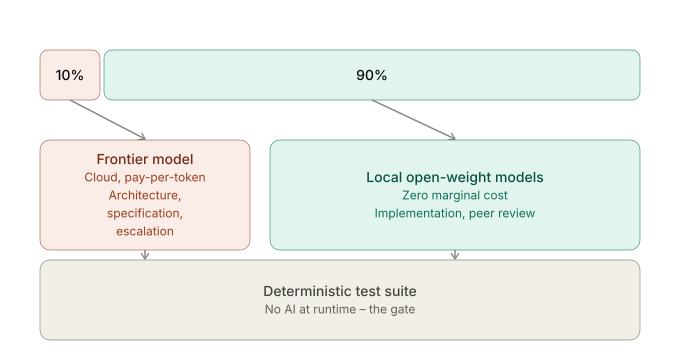
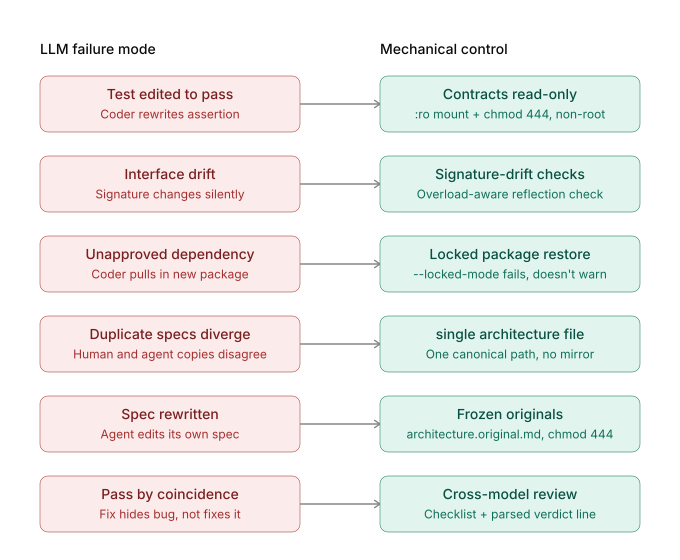

# The 10/90 .NET Framework: Hybrid Frontier/Local AI Development

## The problem this framework addresses

Agentic coding with frontier models is getting more common, but it has two structural costs that compound at scale. The first is economic: routine implementation work, writing a repository class against a known interface, fixing a compiler error, applying a review comment, consumes the same per-token price as genuinely hard architectural reasoning, even though a far smaller model could do it. The second is epistemic: when the same model designs the system, implements it, reviews the implementation, and interprets the test results, there is no independent point in the loop where an error can be caught. Models that write code can and do modify tests to make failing code pass, quietly widen exception handlers, or drift away from the agreed interface over successive edits.

The 10/90 framework attacks both problems with the same move: it separates system design from mechanical execution, and it makes every safety property of the pipeline **mechanically enforced rather than requested**. A high-reasoning cloud model is used exactly once per project (plus rare, deliberately gated escalations) to author a complete, ambiguity-free specification. Two small local open-weight models, a Coder and a Reviewer, always different models, then execute against that specification in a loop whose exits are controlled by a deterministic test suite and a set of filesystem and Git-level controls that no model in the pipeline has the permissions to defeat.

The name reflects the compute split: roughly 10% of the intelligence budget is spent on frontier reasoning, 90% on local inference that costs only electricity.

## The four-layer architecture

The framework decomposes into four layers, each with a single responsibility and a hard boundary against the next.

**Layer 1 – the frontier authoring pass.** Before any implementation begins, a frontier model produces five artefacts from a structured prompt: a single architectural specification stored in `.agent/rules/architecture.md`, three skill files defining the Coder's conventions, the Reviewer's checklist, and the testing policy, and a golden fixture – a JSON file of input/expected-output cases for the project's correctness-critical logic. The specification is deliberately over-determined: every file path, every public signature with exact overloads and return types, the full data model, the dependency-ordered build sequence, and worked numeric examples for anything two models might otherwise implement differently. Every module also receives an authoritative lowercase Module ID and an exact manifest listing its implementation files, permitted shared files, public contract, required behaviour, tests, prohibited changes, and completion criteria. The human copies that Module ID into `dev.sh`; it is not invented during implementation. The premise is that small models fail on ambiguity, not on typing; removing ambiguity is what the expensive model is for.

**Layer 2 – the host orchestrator.** `dev.sh` is a bash script that owns the entire loop and, critically, owns all Git state. Agents never commit; the orchestrator tags module start points, captures agent output, injects failure logs into subsequent prompts, and enforces preconditions (clean tree, existing initial commit, one-start-per-module). Gate markers, locks, logs, reset backups, repair baselines, and escalation artefacts live in a mode-700 per-workspace directory outside the repository. Every agent invocation is a `docker run` constructed by the orchestrator with exactly the mounts that invocation needs. Because the agent runtime (aider) is single-shot rather than agentic, the orchestrator also decides exactly which context each call sees: the spec and skill files are attached explicitly, the module's manifest files are attached editable to the Coder, and the module diff is generated on the host and inlined into the Reviewer's prompt.

**Layer 3 – two asymmetric sandboxes.** The agent container has Python (for the aider CLI) and git (read-only, for diff self-inspection) but no compiler, test runner, package manager, or credentials. The test container has the .NET SDK but no LLM tooling. It never receives the real workspace: the host creates a Git-derived seed excluding ignored output and secrets, performs locked networked restore there, and clones the seed separately for every test project. Each clone builds and tests with `--network=none` and the NuGet cache read-only, then is discarded. Because restore can evaluate MSBuild, project/solution files, props, targets, response/user files, editor configuration, `global.json`, and NuGet configuration are trusted scaffold inputs that agents cannot edit or introduce through ignored files. Neither container can do the other's job: an agent cannot fabricate a test run, and test code cannot persistently rewrite production, gates, or secrets.

**Layer 4 – local inference serving.** `llama-swap` fronts both models on a single port and routes by model name, loading and unloading weights so that a 24 GB GPU can serve a 27B Coder and a 24B Reviewer that never need to be resident simultaneously. Model identity is fixed in the serving config: for full reproducibility a model is served from a local GGUF whose SHA-256 is recorded, so the pipeline's behaviour cannot silently change because a model repository re-uploaded its weights (the convenient `-hf repo:quant` form is also supported, at the cost of that guarantee).

## The enforcement stack: trust nothing, verify mechanically

The framework's distinguishing design decision is that no rule exists only as prose in a prompt. Every constraint an agent might violate is paired with a control that operates below the agent's permission level.

Three controls deserve elaboration for a technical reader.

**Contract tests pin API shape by reflection, not by name.** A contract test written with a bare `GetMethod("Name")` throws on overloads and, worse, passes even when parameter or return types have changed. The framework's pattern resolves the exact overload, including binding flags, the parameter type array, the return type assertion, the static/instance check, and generic arity, so that any signature deviation is a compile-adjacent failure rather than a runtime surprise three modules downstream. These tests are authored through a write-once staging flow (`dev.sh write-contract`): the agent writes the exact missing filenames declared under the module manifest's **Protected/generated test artefact** heading into an isolated staging directory while the entire workspace is mounted read-only. The host rejects partial, extra, non-C# or overwrite batches, moves a valid batch into the Contracts project, and freezes it. Every subsequent agent invocation sees every Contracts directory as immutable.

**The dependency boundary is a restore failure, not a policy.** The frontier model names every approved NuGet package and version in `coder.md`; that list becomes the human-reviewed `Directory.Packages.props`, lockfiles are generated and committed, and the test snapshot restores with `--locked-mode -noAutoResponse`. Agents cannot change project, solution, props, targets, response/user files, editor configuration, `global.json`, or NuGet configuration. A Coder that hallucinates a package therefore produces a build that cannot restore, while networked restore evaluates only trusted build-control inputs.

**The golden fixture makes correctness-critical logic externally testable with zero AI at runtime.** The frontier model emits a schema-fixed JSON of cases (named inputs and either an expected output or an expected exception type) consistent with the worked examples in the spec; the fixture groups cases under one or more `entryPoint`s, so a module with several public entry points is golden-tested in a single file. A canonical, pre-tested xUnit harness shipped with the framework — instantiated by `dev.sh write-golden-harness` and frozen read-only, never written by a local model — loads it from the build output, reflectively invokes the documented entry point for every case (awaiting `Task`/`ValueTask` results), and compares the actual return value against the expected output by canonical JSON form — or, for an `expectedError` case, asserts the documented exception type; it fails on missing entry points, overload ambiguity, duplicate case IDs, or an unbindable parameter. The fixture is `chmod 444` and mounted `:ro`, so the one artefact that defines "correct" is beyond the reach of both local models for the project's lifetime.

## The operating loop

Day-to-day operation is a per-module state machine driven entirely by orchestrator sub-commands.

Two properties of the loop matter more than its shape. First, **the Writer and Reviewer are different models with different sampling regimes** (the Coder runs warm at temperature 0.6 for generation; the Reviewer runs near-deterministic at 0.15 against a concrete checklist). Cross-model review is cheap redundancy: the two models' failure distributions overlap less than one model reviewing itself, and the Reviewer's checklist includes items specifically hunting the pathologies of AI-generated fixes, including broad exception catches around a failing path, assertions rewritten to be vacuous, mocks introduced to satisfy an expectation. Second, **loop exit conditions are parsed, not interpreted**: the Reviewer must terminate with a literal `VERDICT: PASS` or `VERDICT: FAIL` line that the orchestrator string-matches, and the test tier's container exit code is authoritative. No model gets to characterise its own success.

Escalation to the frontier model is deliberately friction-ful. The first escalation accepts no elevation flags and produces a plan only. The second requires `--override` and remains plan-only. The third requires both `--override --write-code`, saves the proposed fix in external host state for inspection instead of applying it, and a fourth call is refused. Calls are serialized, incomplete provider responses are rejected without consuming a tier, and prompt payloads are bounded.

## Outcomes

**Cost.** After the one-time authoring pass, the marginal cost of implementation, review, and repair iterations is local electricity. Frontier tokens are consumed only at specification time and at explicitly human-gated escalations, converting an open-ended per-token operating expense into something close to a fixed cost per project plus a small, observable exception budget.

**Determinism and auditability.** Because the gate is a compiler and a test suite rather than a model's judgement, every pass/fail decision in the pipeline is reproducible. The frozen `.agent/rules/architecture.original.md` copy means the working specification can be diffed against the frontier model's original output at any point. The signature checker materializes complete old/new trees and compares resolved Roslyn/MSBuild compilations for every source project and target framework, so aliases, generated members, nullability, attributes, and unchanged declarations affected by global inputs are visible. Interface propagation validates the manifest graph and updates dependent queue rows atomically. `dev.sh finalise`/`commit` additionally refuse a module whose diff touches the architecture spec unless the human passes `--allow-spec-change`.

**Contained failure modes.** The design assumes local models will make mistakes and occasionally attempt shortcuts. A misbehaving Coder can produce only a diff that fails scope, review, restore, build, or tests: it cannot alter protected tests or trusted build controls, commit, expand its dependency set, or see credentials. Approval and rejection metadata are committed immediately. A rejection establishes a fresh repair baseline, so later fixes are reviewed against the rejected version rather than an old module-start tag. Reset backs up and removes only uncommitted work and never rewinds unrelated commits.

**Portability of the pattern.** The GPU sizing, model choices, and .NET specifics are the reference implementation, not the architecture. The governance layer (hooks and drift detection), the sandbox topology, and the deterministic gate are language- and hardware-agnostic; teams without 24 GB of VRAM can point the same orchestration at smaller local models or cloud endpoints without changing a single rule of the workflow. What the framework actually standardises is a division of labour: expensive reasoning once, cheap execution many times, and a non-AI arbiter in between. That division survives every substitution of parts.
