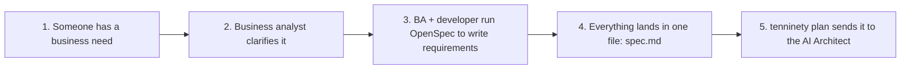
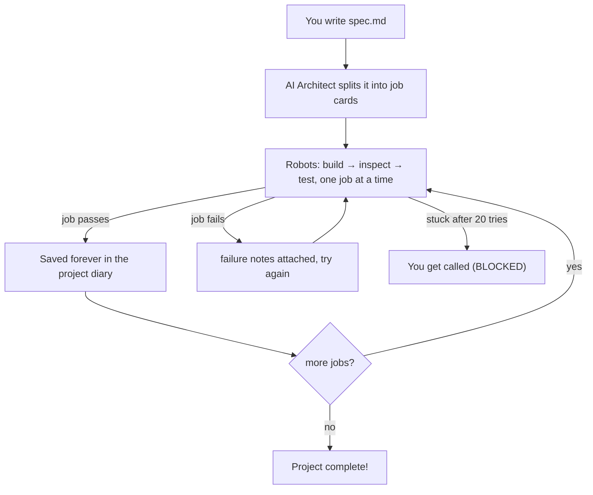

# 10/90 tenninety – Guide for Junior Developers

This guide assumes you are **new to .NET and C#**. Every step explains what you are doing,
why it exists, and what result to expect. If you already write C# daily, read
[SENIOR-GUIDE.md](SENIOR-GUIDE.md) instead – it is the short version.

---

## Part 0 – What is this thing? (the big picture)

Imagine a construction site:

- You (the **Human**) write a *blueprint*: a document called `spec.md` describing WHAT to
  build – the business rules, the technology to use, maybe some screen sketches.
- An AI **Architect** (called the *Frontier model*) reads your blueprint and splits it into
  a numbered list of small jobs called **Work Packages** (WP-001, WP-002, …), each with
  instructions (*directives*) and ways to check the job was done (*acceptance criteria*).
  Some jobs depend on others ("build walls before the roof") – this forms a graph that must
  never contain circular dependencies.
- A team of robot workers (local AI models) then builds the jobs **one at a time**, in
  dependency order:
  1. the **Coder** writes code,
  2. the **Reviewer** reads the code and says PASS or FAIL (with reasons),
  3. the **Tester** runs automated checks.
  If someone fails, the work goes back to the Coder with the failure notes attached, and
  it tries again – up to 10 times. After 10 failures the AI Architect is asked for repair
  advice. After 20 total failures the job is marked **BLOCKED** and a human is told.
- Every finished job is **merged** into the project's main line (`main` branch in git).
- You watch everything on a dashboard and can intervene: pause, redirect the plan
  (**pivot**), or undo a bad change (**revert**).

The program that plays the "site manager" role is a command-line tool named `tenninety`.
Everything happens on your computer using **git** (a version-control time machine) plus
plain files – there is no database or cloud service required.

The same story as pictures. These are **Mermaid diagrams** – the boxes and arrows are just
text in this file; GitHub and many editors draw them automatically.

Where your blueprint comes from (the preparation you do *before* any robot starts):



What happens after that (the site at work):



---

## Part 1 – Words you will meet (glossary)

**Tools & platform words**

| Word | Meaning |
| --- | --- |
| Terminal / shell | The text window where you type commands. This guide shows every command twice where they differ: once for **bash**, once for **fish** (fish 3 or newer). Lines starting with `$` are commands you type. |
| .NET | Microsoft's developer platform. Programs written in C# run on it. |
| SDK | *Software Development Kit* – the toolkit that **compiles** (translates) your C# code into a runnable program. We need the .NET **10** SDK. |
| C# (pronounced "C sharp") | The programming language used here. Version 14 is the newest. |
| `dotnet` | The main command of the SDK. `dotnet build`, `dotnet test`, `dotnet run` are its subcommands. |
| Solution / project | A *solution* (`.slnx`) is a container of *projects*; each project (folder with `.csproj`) compiles into one program/library. |
| NuGet | Package manager for .NET – like an app store for reusable code libraries. |
| bin/, obj/ | Folders where the compiler dumps temporary/final build outputs. Never edit them. |
| JSON | Text format for structured data: `{"name": "value"}`. Our settings and plans are JSON files. |
| JSONL | "JSON Lines": one JSON object per line – used for the audit log. |
| git | Version control: records snapshots (*commits*) of your files; *branches* are parallel lines of work; *merging* combines them. |
| LLM | Large Language Model (an AI that reads/writes text). The Architect and the worker AIs are LLMs. |
| API key | A secret password string for calling an AI service over the internet. Kept in *environment variables*, never in files. |
| Mock | A fake stand-in. Mock mode lets the whole system run with **no real AI and no internet** so you can learn safely. |

**Framework words**

| Word | Meaning |
| --- | --- |
| `spec.md` | Your blueprint document (Markdown formatting). The single source of truth. |
| Work Package (WP) | One small job, e.g. "Create AppDbContext". Has an id (`WP-001`), a layer, a module, directives, acceptance criteria, dependencies. |
| Module / bounded context | The part of the system a job belongs to (e.g. Identity, Orders). A way to slice big plans into feature areas. |
| AMBIGUOUS / CONFLICT | Warning flags the Architect writes into a job's *notes*: "I had to guess" vs "your spec contradicts itself – I refuse to guess". See Part 4, Step 4. |
| `plan.json` | The list of all Work Packages + global context – the machine-readable execution plan. |
| Frontend… sorry, **Frontier** | The big external AI acting as Architect (needs internet + API key). In mock mode it is faked locally. |
| Orchestrator | The site-manager loop: picks the next ready job, drives Coder→Reviewer→Tester, merges successes. |
| Coder / Reviewer / Tester | The three worker roles (AI models in live mode, simple scripts in mock mode). |
| Escalation | After 10 failed attempts, asking the Frontier Architect for repair advice; attempt counter restarts. |
| BLOCKED | A job that failed 20 times total. Humans must intervene. Jobs depending on it wait forever ⇒ the whole queue stops (deadlock). |
| Pivot | Changing direction mid-project: the Frontier reclassifies jobs as KEEP / REWORK (do again) / CANCEL, possibly adding new ones. A REWORK also *resolves* AMBIGUOUS/CONFLICT flags. |
| Revert | Undoing a previously merged change by creating a *new* commit that reverses it (history is never rewritten). |

---

## Part 2 – Before you start (one-time setup)

You need exactly two tools installed:

1. **.NET 10 SDK** – download from https://dotnet.microsoft.com/download (choose .NET 10).
   Why the *SDK* and not just the "runtime"? The runtime only *runs* programs; the SDK also
   contains the compiler that turns our source code into a runnable program.
2. **git** – https://git-scm.com. The framework stores all progress as git commits.

Check both work (any terminal):

```bash
$ dotnet --version
10.0.111                      # any 10.x is fine

$ git --version
git version 2.55.0            # any recent version is fine
```

---

## Part 3 – Get the code and understand the folders

Open a terminal in the `10-90new` folder (the framework's source code). You will see:

```
src/
  Tenninety.Core/        Data files' shapes + safety rules (the "contracts")
  Tenninety.Git/         All git operations (branches, merging, reverting)
  Tenninety.Frontier/    Talking to the AI Architect (prompts, HTTP client, offline fake)
  Tenninety.Execution/   The worker agents + the engine that runs the retry loop
  Tenninety.Tui/         The dashboard you see when running interactively
  Tenninety.Cli/         The 'tenninety' program itself (parses your commands)
tests/                   Automated checks that prove the pieces work
samples/spec.md          An example blueprint you can copy
docs/                    More guides (this file, senior guide, design rationale)
```

You do **not** need to read the C# source to use the tool – but Part 9 tells you where to
look when you get curious.

### Build it and run the tests

```bash
$ dotnet build -c Release
  ... Build succeeded.        ← the compiler translated all C# to runnable form; 0 warnings

$ dotnet test
  Passed! - Failed: 0, Passed: 1,063, Skipped: 10, Total: 1,073
```

The 10 skips are the Docker integration categories (they stay skipped until you opt in with
the documented environment variables). Why run tests? They simulate dozens of scenarios
(broken plans, failing reviews, git
operations) in milliseconds and prove the framework behaves as documented before you trust
it with real work.

After building, your executable lives at
`src/Tenninety.Cli/bin/Release/net10.0/tenninety`. Below we shorten it to `$T`:

```bash
# bash
$ T=/full/path/to/10-90new/src/Tenninety.Cli/bin/Release/net10.0/tenninety
$ $T --help                  # prints the command list
```

```fish
# fish (note: "set T", no "=" sign)
$ set T /full/path/to/10-90new/src/Tenninety.Cli/bin/Release/net10.0/tenninety
$ $T --help                  # prints the command list
```

(Alternative: `dotnet run --project src/Tenninety.Cli -- <command>` – slower, but no path
juggling.)

---

## Part 4 – Your first autonomous run (no internet, no API keys needed)

We will let the framework build a tiny pretend project end-to-end in *mock mode*. Mock mode
is the default (`"provider_mode": "mock"` in the config): both the AI Architect and the
workers are replaced by deterministic local scripts, so nothing leaves your machine.

### Step 1 – Create a fresh workspace folder

```bash
$ mkdir my-demo && cd my-demo
```

Why a new empty folder? The framework treats your current folder as the *project workspace*
– the place where your app code, git history, and framework state live together. Starting
empty keeps the demo clean.

### Step 2 – Initialize

```bash
$ $T init
Initialized git repository on branch 'main'.
Wrote .tenninety/config.json.
Wrote starter spec.md – replace it with your real spec.
...
╭───────────────────────────────┬─────────────────────────────────╮
│ Next step                     │ Command                         │
├───────────────────────────────┼─────────────────────────────────┤
│ 1. Write your spec            │ edit ./spec.md                  │
│ 2. Generate execution graph   │ tenninety plan --spec ./spec.md │
│ 3. Review plan.json           │ tenninety status                │
│ 4. Start autonomous execution │ tenninety start                 │
╰───────────────────────────────┴─────────────────────────────────╯
provider_mode=mock: frontier + local agents are simulated offline. ...
```

What just happened, file by file?

| Created | What it is | Why |
| --- | --- | --- |
| `.git/` | A fresh git repository on branch `main` | All progress is stored as commits – the "time machine" |
| `.tenninety/config.json` | Settings: which models, endpoints, budgets | You edit this to go live later |
| `.tenninety/.gitignore` | Ignores runtime state, locks, logs, and control markers | Those change constantly; keeping them out of git keeps the workspace tidy (the engine refuses to run on a messy workspace!) |
| `spec.md` | Starter blueprint for you to replace | This is YOUR part – the framework never invents requirements |

### Step 3 – Write your blueprint

Open `spec.md` in any editor and put something real in it. A good spec has three sections:

```markdown
# TaskManager

## Business Rules
- Users manage tasks; each task has a status TODO → DOING → DONE.

## Technical Hints
- Tech stack: .NET 10 Web API, PostgreSQL.

## UI Descriptions
- Dashboard: projects on the left, task board on the right.
```

Why these sections? The AI Architect looks here for *what to build* (rules), *what to build
it with* (hints), and *what screens to make* (UI). Vague spec ⇒ vague plan. The spec is the
source of truth: if it is not written here, nobody will build it.

Teams that want a more rigorous pipeline can author requirements with
[OpenSpec](https://openspec.dev/) first and consolidate them into `spec.md` – the whole
process is described in [`SPEC-AUTHORING.md`](SPEC-AUTHORING.md).

Copy `../samples/spec.md` if you want a ready-made example.

### Step 4 – Ask the Architect for a plan

```bash
$ $T plan --spec ./spec.md --yes
INFRA: 1 WP(s)
DOMAIN: 1 WP(s)
...
╭───┬────────┬──────────┬──────────────────────────────┬────────┬────────────┐
│ # │ ID     │ Layer    │ Title                        │ Deps   │ Directives │
├───┼────────┼──────────┼──────────────────────────────┼────────┼────────────┤
│ 1 │ WP-001 │ INFRA    │ Scaffold project & infra...  │ -      │ 2          │
│ 2 │ WP-002 │ DOMAIN   │ Implement core domain entit. │ WP-001 │ 2          │
│ ...
Wrote .tenninety/plan.json. Review with 'tenninety status', then run 'tenninety start'.
```

Reading the table:

- **Layer** = which level of the app this job belongs to. Lower layers are built first:
  `INFRA` (scaffolding) → `DOMAIN` (business objects) → `DATA` (saving things) →
  `APP` (workflows) → `API` / `UI` (endpoints & screens) → `TEST` (checks).
  A job in a lower layer is never allowed to depend on one in a higher layer – the
  framework rejects such plans outright.
- **Module** = which part of the system the job belongs to (the Architect groups work into
  *bounded contexts* like Identity, Orders, Catalog). Same module name across layers = one
  feature slice.
- **Deps** = jobs that must finish before this one starts. Notice how they point backwards –
  that ordering is the "no circular dependencies" rule.
- **Directives** = number of concrete instructions for the Coder.
- **Notes** = usually empty; sometimes the Architect writes a warning here:

| Notes says | Meaning | What happens |
| --- | --- | --- |
| `AMBIGUOUS` | Something in your spec was unclear; the Architect guessed a sensible default and recorded it under *Assumptions* | The job still runs, but you should read the note and confirm the guess |
| `CONFLICT` | Your spec contradicts itself; the Architect refuses to guess and gives NO instructions | The job is **skipped** until you fix it with a pivot (`[S]` → REWORK). Everything that depends on it waits |

What just happened? The framework sanitised your spec (removed anything resembling
passwords/keys – a safety rule), sent it to the "Architect" (the local mock in this mode),
got back a structured plan, **validated** it (unique ids, dependencies exist, no cycles,
layers point the right way), showed it to you, and saved it as `.tenninety/plan.json`.

The `--yes` flag auto-confirms. Without it you get asked *"Accept this execution graph?"*
– reviewing before accepting is the recommended habit: **a wrong plan means hours of wrong
robot work.**

### Step 5 – Start the robots

```bash
$ $T start --headless
Serial execution started (Ctrl+C for a graceful stop).
[tenninety] [WP-001] started on branch 'work/WP-001'
[tenninety] [WP-001] attempt 1 (phase count 1/10)
[tenninety] [WP-001] PASSED – promoted to main
[tenninety] [WP-002] started on branch 'work/WP-002'
...
All work packages are DONE.
```

Line by line, what happened for EACH work package:

1. `started on branch 'work/WP-001'` – git branch created, isolating this job's changes.
2. `attempt 1 (phase count 1/10)` – the Coder edited files, the engine committed them, then
   the Reviewer and Tester checked the result. First number = attempts used since last reset;
   `(x/10)` = budget until the Architect gets involved.
3. `PASSED – promoted to main` – reviewer said PASS, tests passed, so the branch was merged
   into `main` (one squashed commit) and deleted. State updated. Next job!

See it yourself:

```bash
$ git log --oneline            # every promotion is a commit on main
$ ls app/                      # what the mock coder produced per job
WP-001.implementation.md  WP-002.implementation.md ...
```

(In mock mode the "code" is a summary document instead of a real program – the *process*
being demonstrated is identical to live mode.)

### Step 6 – Check the scoreboard

```bash
$ $T status
Project TaskManager  Mode serial  Provider mock ...
Branch main   Tree clean   Spec hash 71c985c0 ...
╭─ Queue ──────────────────────────────────────────╮
│ Status    │ WP     │ Layer  │ Title      │ Attempts │
│ [DONE]    │ WP-001 │ INFRA  │ Scaffold…  │ -        │
│ [DONE]    │ WP-002 │ DOMAIN │ Implement… │ -        │
```

Statuses: `PENDING` waiting · `ACTIVE` being worked · `DONE` merged ·
`BLOCKED` gave up after 20 tries · `CANCELLED` removed by a pivot.
`Tree clean` means every change is committed – the engine requires this before running.

---

## Part 5 – Watch the safety nets catch failures (still offline)

Edit `.tenninety/config.json` to make the fake Reviewer stubborn. Important: because
`config.json` is tracked in git, save your edit as a commit first (the clean-tree rule):

```bash
$ nano .tenninety/config.json       # set:  "reviewer_fail_attempts": 11
$ git add -A && git commit -m "config: simulate review failures"
$ $T start --headless
[tenninety] [WP-001] attempt 1 (phase count 1/10)
[tenninety] [WP-001] review FAILED (2 reasons)
...
[tenninety] [WP-001] attempt 10 (phase count 10/10)
[tenninety] [WP-001] escalating to Frontier for repair advice…
[tenninety] [WP-001] advice injected – local counter reset
[tenninety] [WP-001] attempt 11 (phase count 1/10)     ← counter restarted!
[tenninety] [WP-001] PASSED – promoted to main
```

That is **escalation**: after 10 failures within a phase, the Architect reads all failure
notes and returns advice; the Coder retries with that advice attached.

Now the giving-up path – also set `"reviewer_ignores_advice": true`, commit again, rerun:

```text
[tenninety] [WP-001] BLOCKED after 20 attempts
ACTION REQUIRED: 'WP-001' is BLOCKED after 20 attempts.
Queue deadlocked (BLOCKED WPs block their dependents).
```

Twenty total failures ⇒ humans decide. Note WP-002 stays `PENDING`: it depends on WP-001.
The blocked job's branch `work/WP-001` is kept so you can inspect what was attempted.

**Pause / stop / resume** – the daemon only stops at *safe points* (between coder, reviewer,
tester, attempt, or job stages),
so state files are always consistent:

```bash
$ $T stop        # daemon finishes current safe point, saves, exits
$ $T resume      # clears the flags
$ $T start --headless   # picks up exactly where it left off
```

---

## Part 6 – Undoing a bad merge (revert)

Suppose a promoted change broke something:

```bash
$ git log --oneline                       # find the bad commit, copy its short hash
26b7e10 WP-101: materialized directives...

$ $T revert 26b7e10 --reason "regression"
[tenninety] reverting 26b7e10c8e02 on branch 'hotfix/revert-26b7e10c'
[tenninety] frontier step: Create hotfix branch from main.
[tenninety] frontier step: Run mechanical tests; merge only on PASS.
[tenninety] revert promoted to main (c3a690f7d5d9)
reverted 26b7e10c8e02 via c3a690f7d5d9.
```

What happened: the Architect was asked "how should we undo this?", the framework applied a
mechanical reverse-commit on a `hotfix/…` branch, ran the test suite, and only merged back
because the tests passed. History is never rewritten – the fix is a *new* commit whose name
starts with `Revert "…"`.

---

## Part 7 – Later: connecting real AI models

When mocks feel boring:

1. Start local model servers (they imitate the standard OpenAI web-API shape):
   `docker compose up -d` from the framework root (coder on port 8000, reviewer on 8001).
2. Build or obtain digest-pinned role images. The Coder image must contain
   [aider](https://aider.chat), OpenCode, or Pi according to the `"coder_agent"` knob;
   OpenCode/Pi require an explicit agent `model`. The Reviewer model call stays host-controlled,
   while its repository exploration runs in an offline Reviewer image.
3. Edit `.tenninety/config.json`:
   `"provider_mode": "aider"`,
   `"local_models": { "coder": "coder", "reviewer": "reviewer", "coder_endpoint": "http://localhost:8000/v1", "reviewer_endpoint": "http://localhost:8001/v1" }`, and set your real
   `"frontier_endpoint"` / `"frontier_model"` if you have one. For Docker mode, also configure
   the pinned role images and internal model network from
   [`SANDBOX-CONFIG.example.jsonc`](SANDBOX-CONFIG.example.jsonc); the Coder's in-container
   endpoint is `sandbox.roles.coder.model_endpoint`, not host loopback.
4. Use different coder and reviewer identifiers, and verify that your model server maps them
   to genuinely different weights – different aliases can otherwise point at the same model.
   If both models do not fit your GPU card together, set `"use_llama_swap": true` for the
   default aider setup. OpenCode/Pi also need their own provider configured for that proxy
   (see [`OVERVIEW.md`](OVERVIEW.md)).
5. Give secrets via environment variables (never in files – that is a security rule):
   ```bash
   # bash
   $ export TENNINETY_FRONTIER_API_KEY="sk-..."
   ```
   ```fish
   # fish
   $ set -x TENNINETY_FRONTIER_API_KEY "sk-..."
   ```
6. Commit the config change, then `tenninety plan --spec ./spec.md` and review very carefully
   – now the plan comes from a real model, and plans are only as good as your spec.

Live-mode safety note: Docker mode isolates role commands from the authoritative repository, but
the Docker daemon and host orchestrator are still trusted. Use pinned images and least privilege.
Never select `sandbox.mode=unsafe-host` for untrusted generated code.

---

## Part 8 – When something goes wrong

| Message | What it means | What to do |
| --- | --- | --- |
| `no '.tenninety/' directory found` | You are not inside an initialized workspace | `cd` into your project folder, or run `tenninety init` |
| `spec not found` | Path typo, or forgot `--spec` | Check the filename; default is `./spec.md` |
| `Working tree is not clean` | Unsaved changes (maybe you edited config) | `git add -A && git commit -m "…"` then retry |
| `frontier planning failed` | No internet/key while NOT in mock mode | Fix endpoint/key, or stay in mock mode |
| `branch 'work/X' already exists` | Very old build | Update/rebuild the framework – current versions reuse the branch |
| Queue deadlocked (exit 4) | A BLOCKED job gates everything else – or a job is flagged `CONFLICT` | Fix the root cause or pivot; then `resume` + `start` |
| `⚠CONFLICT` next to a WP in status | Your spec contradicts itself; that job has no instructions | Fix the spec, then run a pivot (`tenninety start` → `[S]`) with REWORK for that job |
| Tests fail forever on one WP | Real bug in generated code, or spec too vague | Inspect `work/X` branch, improve the spec/directives, apply a pivot REWORK |

Golden rules: **commit often** (the engine demands a clean tree), **read the plan before
accepting**, and when confused run `$T status` and `$T` `[L]` logs – the audit trail tells
you everything that ever happened.

---

## Part 9 – Where to look in the code when curious

| Curious about… | Open |
| --- | --- |
| What shapes plan.json/state.json | `src/Tenninety.Core/Models/*.cs` |
| How the retry loop works | `src/Tenninety.Execution/ExecutionEngine.cs` |
| Which job runs next | `src/Tenninety.Execution/Orchestrator.cs` (`SelectNextReady`) |
| What git tricks are used | `src/Tenninety.Git/GitService.cs` |
| What is sent to the AI | `src/Tenninety.Frontier/Prompts/Prompts.cs` |
| How passwords are scrubbed | `src/Tenninety.Core/Security/Sanitizer.cs` |
| The commands you type | `src/Tenninety.Cli/Program.cs` |

Then try changing something small yourself (e.g., add an audit event) – `dotnet test` will
tell you if you broke a rule.

## Part 10 – Practice exercises

1. Fresh demo: run through Part 4 without copying commands – explain each step aloud.
2. Set `mock.tester_fail_attempts = 2`: predict the log before running, then compare.
3. Reproduce a BLOCKED WP, then inspect `git log work/WP-001` to see the 20 attempts.
4. Pause mid-run, run `tenninety status`, confirm the WP went back to `PENDING`, resume.
5. Revert the oldest promotion in a completed demo; verify with `git log` that history was
   preserved (a new `Revert…` commit, no deletions).
