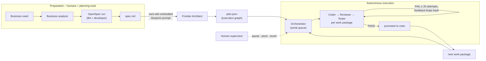
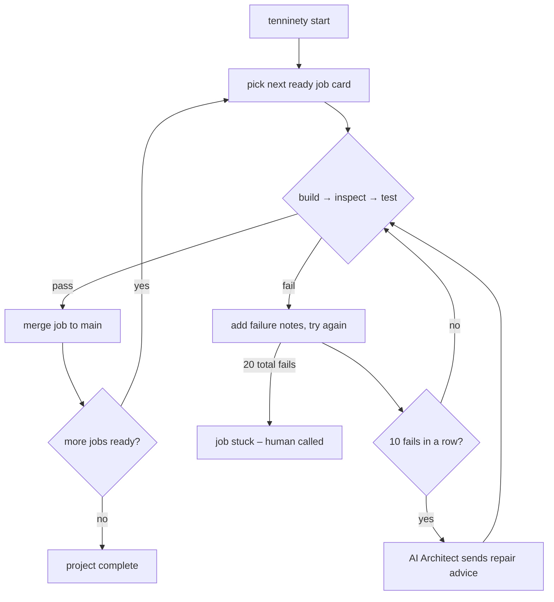

# How 10/90 works

This page holds the detailed explanation of the framework: the execution model, the design
guarantees, the blueprint integration and the repository layout. The README is only the front door.

---

## Process model – waterfall for the build, agile for change

The two halves of 10/90 follow deliberately different philosophies:

- **The orchestrator is waterfall.** Once `plan.json` is accepted, jobs are built strictly in
  dependency order, one at a time, with no reordering or scope drift decided by the machine.
  Predictability is the point: every promotion to `main` corresponds to an approved job card.
- **Change is agile.** Humans can introduce new or altered requirements at *any* stage:
  run a new OpenSpec change proposal, consolidate it into `spec.md`, then trigger a pivot
  (`[S]`) so the Frontier classifies every existing package as KEEP / REWORK / CANCEL and adds
  new packages where needed. Completed packages are normally KEEP; no promoted work is thrown
  away automatically.

---

## The pipeline





Authoring pipeline details: [`SPEC-AUTHORING.md`](SPEC-AUTHORING.md).

---

## Two different models: builder and reviewer

The Coder and the Reviewer should be **completely different models**. Independent peer review
only catches what the builder cannot see when the reviewer does not share the builder's
weights, training and blind spots. The framework enforces different configured identifiers
whenever live agents are created; operators must ensure aliases with different names do not
resolve to the same weights.

This separation is one of the core selling points of 10/90: a cheap coding model does the
typing while a differently-trained model judges the result, and the deterministic test suite
arbitrates their disagreement.

## The coding agent: aider, OpenCode or Pi

In live mode the Coder role runs a terminal coding agent inside a hardened disposable container –
you choose which one with the `coder_agent` knob in `.tenninety/config.json`:

| `coder_agent` | Tool | Behaviour |
| --- | --- | --- |
| `"aider"` (default) | [aider](https://aider.chat) | model string defaults to `openai/<coder>` pointed at your local endpoint |
| `"opencode"` | [OpenCode](https://opencode.ai) | headless `run --auto`; trusted code maps the explicit `"provider/model"` to the effective local endpoint |
| `"pi"` | [Pi](https://pi.dev) | print mode (`-p --no-session`); model follows pi's `provider/id` notation |

Every agent receives the same instruction – the job card (goal, directives, acceptance
criteria, repair advice, previous feedback) – and edits only a disposable candidate tree mounted
at `/workspace`. After the container is proven removed, trusted host code scans the opaque patch
and promotes it under the already-held daemon lock. The agent never receives an authoritative
repository path or commit capability. Per-agent settings live under `"aider"`, `"opencode"` and `"pi"`
(`model`, `extra_args`) in `.tenninety/config.json`.
OpenCode and Pi require an explicit `model` in live mode so the framework can mechanically
verify that the coder and reviewer identifiers differ. Docker-mode `extra_args` are closed;
Aider also receives `/dev/null` config and environment-file paths. Repository files remain
untrusted tool input, so provider credentials should be narrowly scoped and never stored there.
Containerized OpenCode does not depend on inaccessible host/user configuration: trusted code
serializes a one-provider `OPENCODE_CONFIG_CONTENT` document using
`@ai-sdk/openai-compatible`, the effective container endpoint, the exact configured
`provider/model`, and the literal `{env:OPENAI_API_KEY}` reference. The real key remains only in
the closed Coder environment. Because pinned 1.18.29 cannot reliably suppress every candidate
plugin/instruction discovery path during `run`, candidates containing known project OpenCode
control-plane paths fail closed before a container is created; see `TESTER-SANDBOX.md` for the
exact version-specific path set.

## llama-swap – two models on one card

The coder and reviewer models are deliberately different, which means both must be served. The
default local deployment serves both from **one physical GPU** through
[llama-swap](https://github.com/mostlygeek/llama-swap): a single container (upstream unified
Vulkan image with bundled llama.cpp) hosts both model profiles and swaps the resident GGUF on
demand – when a request names the other model, the loaded one is unloaded first. Only one model
occupies VRAM at a time, so a single 24 GB card (AMD Radeon RX 7900 XTX) is enough. The
repository owns the profiles in `docker/llama-swap.yaml` (`coder`, `reviewer` – pointed at your
own `models/coder.gguf` and `models/reviewer.gguf`, never downloaded at startup and never
committed):

```
              RX 7900 XTX (Vulkan, /dev/dri)
                            ^
       llama-swap container (docker compose up -d)
         /models: coder.gguf | reviewer.gguf   (one resident at a time)
              ^                        ^
   host:  http://127.0.0.1:8080/v1    coder sandbox: http://llama-swap:8080/v1
```

Enable it with the human flag and route each context to its own address:

```jsonc
{
  "use_llama_swap": true,
  "llama_swap_endpoint": "http://127.0.0.1:8080/v1",        // host-side processes
  "llama_swap_coder_endpoint": "http://llama-swap:8080/v1"  // inside the Docker network
}
```

Both addresses exist on purpose and reach the same proxy:

- **`http://127.0.0.1:8080/v1`** is the published host port (loopback only). The host-side
  Reviewer – and an aider Coder under the explicit `unsafe-host` mode – use it.
- **`http://llama-swap:8080/v1`** is the container's DNS name on the internal
  `tenninety-coder-model` network. It exists *only* inside Docker networking; from inside the
  disposable Coder container, `127.0.0.1` would refer to the container itself, which is why the
  second form is a distinct configured endpoint (`llama_swap_coder_endpoint`) and why loopback
  values fail validation in the container context.

Endpoint selection and fail-closed validation are centralized in `ModelEndpointResolver`:
with llama-swap disabled, the sandboxed Coder keeps using `sandbox.roles.coder.model_endpoint`
and host roles keep the shared/per-role endpoint fallback – nothing else changes.

With the default aider coder, both agents route through the proxy by model identifier (aider's
`openai/coder` request carries model `coder`, which matches the profile name). For containerized
OpenCode and Pi, trusted generated provider configuration points at the same effective proxy;
neither relies on host/user provider files.

---

## Design guarantees

Every gate in the pipeline is mechanically enforced rather than requested:

- Framework-built prompt text is sanitised, newly added secret-shaped files are unstaged and
  repo-locally ignored, and coding agents run with a minimal allowlisted environment plus hard
  attempt timeouts. Already tracked files remain tracked; coding-agent CLIs can read the
  workspace and make their own model calls, so credentials must not be stored there.
- Plans are validated (strict DAG, unique ids, atomic directives, layer ordering) at
  acceptance time and again after every pivot.
- Promotions are single squashed commits on `main`; history is never rewritten –
  undos go through `git revert`. A durable promotion transaction binds the execution, expected
  base, reviewed candidate and prepared promotion commit until `main`, saved progress and exact
  candidate-branch cleanup all agree. Internal refs retain the prepared objects against Git garbage
  collection until the transaction is complete, so process-crash recovery never relies on commit
  messages, reflogs, or object-pruning grace periods.
- Work packages execute on disposable branches and promote as ONE squashed commit –
  reverting a package is exact. A stuck job is quarantined as BLOCKED and a human is called
  instead of the queue inventing a way forward. In live mode the mechanical gate fails
   closed: no discovered tests or empty commands mean failure, never silent success.
- Live Docker roles receive only an exact disposable candidate workspace. Coder joins the
  pre-existing model network only after strict Docker inspection proves `Internal=true` – its
  only non-role member is the operator-run
  llama-swap container – and carries no general egress; Reviewer and Tester are `network=none`.
  Optional Restore runs first in a separate operator-accepted restricted network, then a fresh
  offline Tester validates the derived tree.
- Every attempt is recorded in `.tenninety/sandbox-resources.json` before container creation.
  Startup recovery runs under the daemon lock, inventories only this instance/repository label
  scope, deletes only journal-proven direct-child workspaces, and refuses execution if cleanup
  remains quarantined. This scoped cleanup runs even when a crash left a work branch checked out;
  only a clean branch matched to persisted interrupted state is reconciled automatically, while
  dirty or unrelated branches are preserved. `tenninety status` reports persisted recovery facts.

The container boundary is defense in depth, not a substitute for a patched least-privilege Docker
deployment. An explicit `sandbox.mode=unsafe-host` selects the legacy host path and is prominently
reported; Docker failures never fall back to it.

## Frontier blueprint

`tenninety plan` drives the Frontier with the **blueprint prompt**
(Principal Architect & System Decomposer). Plans include the Architect's `architecture_map`
(bounded contexts, core entities, key dependencies) and `global_context.directory_structure`,
every WP carries `module` and `notes`, and the ambiguity protocol is enforced end-to-end:
`AMBIGUOUS` WPs run but are flagged for review, `CONFLICT` WPs (no directives by protocol)
are excluded from execution until a pivot REWORK resolves them. Layer ordering
(`L0 INFRA → … → L5 TEST`) is a hard validation rule – a plan where a lower layer depends on
a higher one is rejected at acceptance time and after every pivot.

The prompt itself is embedded in `src/Tenninety.Frontier/Prompts/Prompts.cs`. To use your own
copy with external tooling, keep its Output Schema section unchanged – it matches this
framework's `plan.json` contract exactly.

## Repository layout

| Path | Purpose |
| --- | --- |
| `src/Tenninety.Core` | Data contracts (`plan.json`, `state.json`, `config.json`), DAG validator, marker detection, secret sanitiser, audit log |
| `src/Tenninety.Git` | Git-first state engine: branches, squash-only promotions, mechanical reverts |
| `src/Tenninety.Frontier` | Frontier prompts (blueprint prompt), OpenAI-compatible HTTP client, deterministic offline mock |
| `src/Tenninety.Execution` | Docker Coder, offline agentic Reviewer, restricted Restore, offline mechanical Tester, startup recovery, plus the 10/20-attempt Execution Engine, serial Orchestrator, Pivot & Revert services |
| `src/Tenninety.Tui` | Supervisor dashboard: queue view, system health, `[P]/[S]/[R]/[L]/[Q]` controls |
| `src/Tenninety.Cli` | `tenninety` executable: `init`, `plan`, `start`, `status`, `pause/resume/stop`, `revert` |
| `tests/Tenninety.Tests` | Validator, sanitiser, JSON extraction, git, engine, agent factory, pivot & store tests |

## Rehearsal mode and failure simulation

Out of the box `provider_mode` is `"mock"`: the Frontier and local agents are simulated
deterministically so the entire pipeline (queue, retries, escalation, promotion, revert) runs
end-to-end offline. Each WP materialises its directives under `app/`.

### Simulating failure paths

Edit `.tenninety/config.json`:

```jsonc
{
  "mock": {
    "reviewer_fail_attempts": 11,       // fail attempts 1..10 → escalation advice → pass at 11
    "tester_fail_attempts": 0,
    "reviewer_ignores_advice": false    // true → WP goes BLOCKED at 20 total attempts
  }
}
```

Commit `config.json` changes before `start` – it is tracked, and the tree must be clean.
