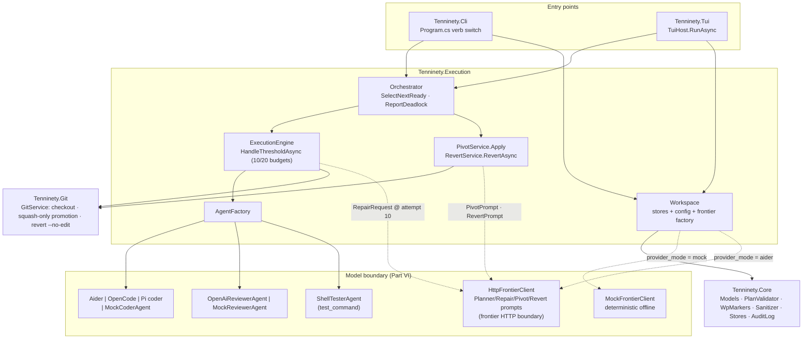
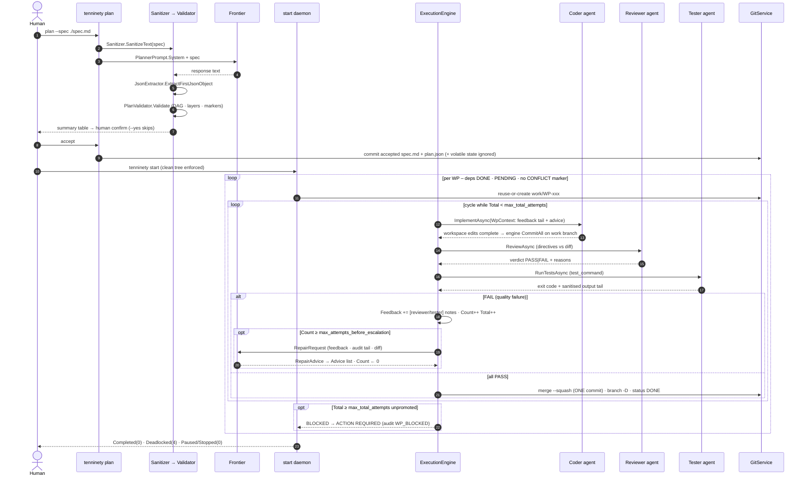
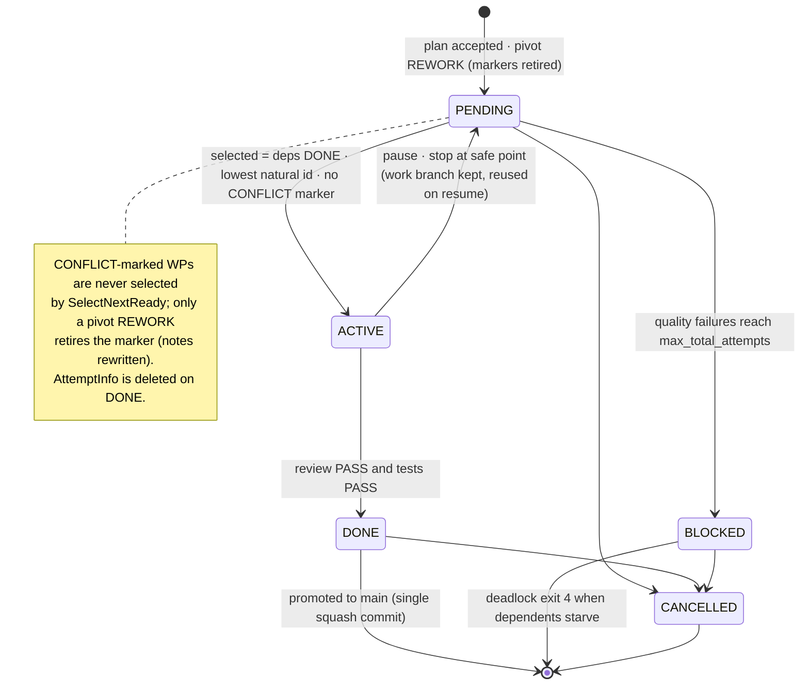
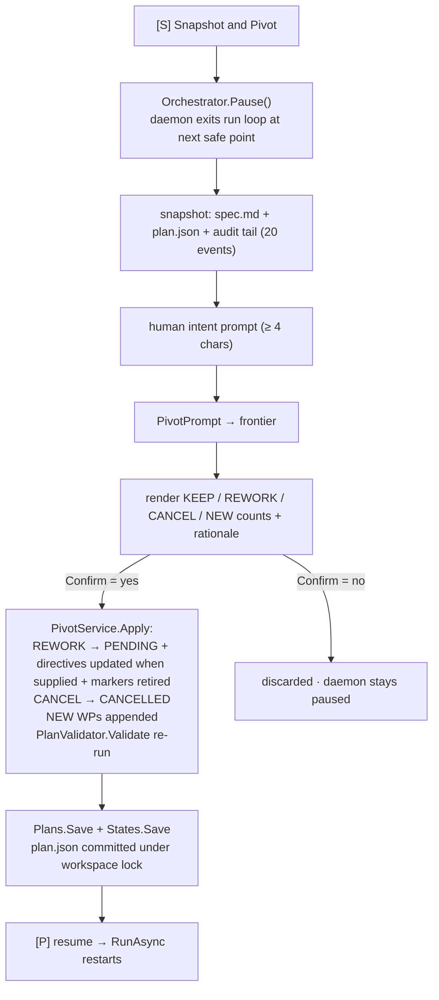

# 10/90 tenninety – Guide for Senior Developers

**Platform:** .NET 10 (`net10.0`), C# 14 · **External deps:** Spectre.Console only
Companion document: [JUNIOR-GUIDE.md](JUNIOR-GUIDE.md) (teaching-level).

---

## 0. Architecture diagrams (Mermaid)

### 0.1 Component graph (project dependencies + key symbols)



### 0.2 End-to-end sequence (live mode)



### 0.3 Work-package state machine



### 0.4 Pivot approval chain ([S])



---

## 1. Build & test

```bash
dotnet build -c Release          # zero warnings expected
dotnet test                      # 1,000+ tests; Docker categories skipped until opted in
dotnet publish src/Tenninety.Cli -c Release -o ./dist   # optional self-contained: -r linux-x64 --self-contained
```

Binary name is `tenninety` (`AssemblyName` in `Tenninety.Cli.csproj`). For ad-hoc runs:
`dotnet run --project src/Tenninety.Cli -- <command>`.

All targets pin through `Directory.Build.props` (`net10.0`, `LangVersion=14.0`). C# 14 is
used deliberately in two places: extension members (`CoderResultExtensions`) and
`field`-backed clamped properties (`TenNinetyConfig` budgets).

---

## 2. Operational lifecycle

```
init ──▶ (author spec.md – see SPEC-AUTHORING) ──▶ plan ──▶ (review) ──▶ start ──▶ supervise (pause/pivot/revert) ──▶ done
```

### Command reference

| Command | Flags | Effect |
| --- | --- | --- |
| `tenninety init` | – | `git init -b main` if needed; writes `.tenninety/config.json`, starter `spec.md`, `.tenninety/.gitignore`; commits state |
| `tenninety plan` | `--spec <path>`, `--yes` | Sanitizes spec → Frontier → validated `plan.json` + fresh `state.json` → human confirm unless `--yes` → canonicalize and auto-commit accepted `spec.md` + plan; refuses to overwrite execution progress |
| `tenninety start` | `--headless` | Runs the serial queue. Interactive TTY ⇒ TUI dashboard; redirected IO ⇒ headless logs regardless |
| `tenninety status` | – | Prints health grid + queue table (no daemon required) |
| `tenninety pause` / `resume` | – | Pause sets a durable marker consumed by the daemon at a safe point; resume clears markers and paused/stop state immediately after the daemon exits |
| `tenninety stop` | – | Requests daemon shutdown at next safe point; progress preserved |
| `tenninety revert <ref>` | `--reason "…"` | Hotfix flow: Frontier guidance → mechanical `git revert` on `hotfix/revert-<sha8>` → mechanical tests → one squash commit on PASS |

**Exit codes:** `0` completed/paused/stopped · `1` runtime error · `2` usage · `4` queue deadlocked.

### TUI keys (interactive `start`)
`[P]` pause/resume (resume relaunches the run loop) · `[S]` Snapshot & Pivot (pauses daemon,
collects spec+plan+audit tail+intent → Frontier KEEP/REWORK/CANCEL diff → confirm-to-apply) ·
`[R]` Revert (commit picker + reason) · `[L]` audit tail viewer · `[Q]` graceful quit.

**Recommended practice – second-opinion plan review:** before confirming a generated graph,
paste `plan.json` (+ the original spec) into a *different* frontier model and ask it to
critique the plan against the blueprint rules (invented requirements, missing coverage,
untestable acceptance criteria, layer violations). Treat findings as spec edits or pivot
input. Rationale: the planner is a single point of interpretation; a decorrelated reviewer
catches drift cheaply. Details in [`SPEC-AUTHORING.md`](SPEC-AUTHORING.md) §Independent plan review.

---

## 3. State model

| File | Tracked | Role |
| --- | --- | --- |
| `spec.md` | yes | source of truth |
| `.tenninety/plan.json` | yes | execution graph (schema_version `3.2`); never mutated by the engine |
| `.tenninety/config.json` | yes | budgets/models/endpoints; budget fields clamp on deserialize (`field`-backed setters) |
| `.tenninety/state.json` | **no** | current WP, attempt bookkeeping, `queue_status`, paused/stop flags |
| `.tenninety/audit-log.jsonl` | **no** | append-only events; feeds pivots, repair requests, `[L]` view |

**Effective status rule:** renderers display `state.queue_status[id] ?? plan.wp.status`.
`plan.json` is the graph; `state.json` is runtime truth. Do not "fix" stale statuses by
editing `plan.json`.

**Blueprint v3.2 Enterprise fields.** Plans additionally carry an optional
`architecture_map` (bounded contexts, core entities, key dependencies) and
`global_context.directory_structure`; every WP has `module` (bounded context) and `notes`
(free-form). The ambiguity protocol lives in `notes`:

| Marker in `notes` | Meaning | Engine behaviour |
| --- | --- | --- |
| `CONFLICT: …` | Contradictory spec rules; no directives generated | **Never scheduled.** Queue drains → deadlock exit 4 naming the unresolved WPs. Resolve via pivot REWORK (which retires the marker and stamps `[resolved by pivot REWORK: …]`) |
| `AMBIGUOUS: …` | Missing detail covered by a recorded assumption | Executable, but flagged ⚠AMBIGUOUS everywhere; plan acceptance defaults to "No" until reviewed |

Detection is exact uppercase-token matching on word boundaries – prose mentioning
"conflict" never triggers it. Layer inversions (a WP depending on a higher-ranked layer)
are hard acceptance errors since the blueprint upgrade.

**Audit vocabulary:** `DAEMON_STARTED/STOPPED/EXITED`, `PLAN_GENERATED`,
`WP_STARTED/PROMOTED/BLOCKED`, `CODER_COMMITTED/FAILED/NO_CHANGE`, `REVIEW_PASSED/FAILED`,
`TESTS_FAILED` (a passing suite is implied by the following `WP_PROMOTED`),
`ESCALATION_ADVICE`, `PAUSED(_REQUESTED)`, `RESUMED`, `STOP_REQUESTED`,
`PIVOT_APPLIED`, `QUEUE_DEADLOCKED`, `REVERT_STARTED/PROMOTED/FAILED_TESTS/ERROR`.

---

## 4. Engine semantics you will be asked about

- **Attempt accounting.** Two counters per WP: phase `Count` (reset on escalation) and
  total-attempts `Total`. Failure path order: increment both → record feedback → if
  `Total >= max_total_attempts` ⇒ `BLOCKED` → else if `Count >= max_attempts_before_escalation`
  ⇒ Frontier `RepairRequest`, reset `Count=0`, append advice to coder context.
- **Feedback accumulation.** Reviewer reasons and sanitised test-output tails accumulate as
  `[reviewer]`/`[tester]` entries; capped at last 20 post-escalation. The coder sees the tail
  of this list plus any Frontier advice every attempt.
- **Branch lifecycle.** `work/<ID>` created from `main` (starting anywhere else is refused).
  Promotion is ALWAYS a single squashed commit on main – reverting it reverts the complete
  package even when attempts left many commits. The branch tip is recorded in the audit log
  before deletion; paused/stopped/blocked runs leave the branch, and resume *reuses* it.
- **Clean-tree invariant.** Orchestrator refuses to run on a dirty tree. This is why the
  runtime-volatile files (`state.json`, `audit-log.jsonl`) are gitignored – they change
  constantly and would otherwise dirty the tree on every write.
- **Selection.** Lowest natural-ordered id among `PENDING` WPs whose dependencies are all
  `DONE`, excluding CONFLICT-flagged packages (they carry no directives by protocol). No
  executable-ready WP + non-terminal WPs ⇒ deadlock exit 4; the report names unresolved
  CONFLICT WPs separately from dependency-starved ones.
- **Revert scope.** Mechanical reverts only. If Frontier says mechanical is insufficient,
  the service refuses before creating a hotfix branch. Revert or test failures after branch
  creation leave that branch for human inspection.

---

## 5. Configuration reference

```jsonc
{
  "execution_mode": "serial",              // anything else throws (NotSupported in v3.2)
  "max_concurrent_workers": 1,             // reserved for the future parallel scheduler
  "provider_mode": "mock",                 // "mock" | "aider" ("openai-compatible" = aider)
  "coder_agent": "aider",                  // "aider" | "opencode" | "pi"
  "frontier_endpoint": "https://api.frontier.ai/v1",
  "frontier_model": "frontier-architect",
  "frontier_api_key_env": "TENNINETY_FRONTIER_API_KEY",
  "local_models_endpoint": "http://localhost:8000/v1",
  "local_models": {
    "coder": "coder", "reviewer": "reviewer", // served names from docker-compose.yml
    "coder_endpoint": "http://localhost:8000/v1",   // optional dedicated endpoint
    "reviewer_endpoint": "http://localhost:8001/v1" // empty falls back to local_models_endpoint
  },
  "use_llama_swap": false,                 // route both models through llama-swap
  "llama_swap_endpoint": "http://localhost:8080/v1",
  "attempt_timeout_minutes": 10,           // hung agent calls are killed and counted
  "aider": {
    "model": "",                           // empty → openai/<coder>
    "extra_args": "--no-auto-commits --yes-always --no-check-update"
  },
  "opencode": { "model": "local/coder", "extra_args": "" }, // explicit when selected
  "pi":       { "model": "local/coder", "extra_args": "" }, // explicit when selected
  "build_command": "dotnet build",
  "test_command": "dotnet test",
  "max_attempts_before_escalation": 10,    // clamped >= 1
  "max_total_attempts": 20,                // clamped >= 1
  "mock": {
    "reviewer_fail_attempts": 0,
    "tester_fail_attempts": 0,
    "reviewer_ignores_advice": false       // true ⇒ exercises the BLOCKED@20 path
  },
  "sandbox": {
    "mode": "docker",                     // or explicit non-isolated "unsafe-host"
    "model_network": "tenninety-coder-model"
    // Digest-pinned role images, limits, Reviewer budgets and optional restricted Restore:
    // see docs/SANDBOX-CONFIG.example.jsonc
  }
}
```

**Distinct-model rule.** Identical configured coder/reviewer identifiers abort live-agent
creation. Independent peer review requires genuinely different weights, but aliases cannot be
verified mechanically; operators must confirm what each endpoint serves.

**llama-swap flag.** When the two models do not fit one GPU card together, set
`use_llama_swap=true` and point `llama_swap_endpoint` at your proxy. The Reviewer and default
aider coder route through it. OpenCode/Pi own their provider transport, so configure the
selected tool's provider/model and authentication for that proxy separately.

Framework secrets are env-var only: `TENNINETY_FRONTIER_API_KEY` (Frontier calls) and optional
`TENNINETY_LOCAL_API_KEY` (framework Reviewer plus aider, translated to `OPENAI_API_KEY`).
Docker Coder tools receive only the closed model environment assembled by trusted code. Use a
narrowly scoped local-model token and never put credentials in project files.

**Live topology** (`provider_mode=aider`): vLLM endpoints per
`docker-compose.yml` (coder `127.0.0.1:8000`, reviewer `:8001`, served names `coder`/
`reviewer`) **or** a single llama-swap proxy when `use_llama_swap=true`. The supplied Compose
model server has a separate egress network for downloads; the disposable Coder joins only the
internal `tenninety-coder-model` network. Live coding requires the selected coding-agent CLI in
the digest-pinned Coder image.

**Sandbox posture:** Docker mode runs Coder, Reviewer exploration, optional restricted Restore,
and Tester commands in disposable containers without the authoritative repository or Docker
socket. `unsafe-host` is the explicit legacy compatibility mode and is never a fallback. A patched,
least-privilege Docker deployment remains part of the trusted computing base.

---

## 6. Failure-injection matrix (offline rehearsal)

| Knob | Exercises |
| --- | --- |
| `mock.reviewer_fail_attempts = N` (N ≤ max) | N review failures → promote on N+1 |
| `= max_attempts_before_escalation + 1` | fail 1..max → escalation advice → pass first post-advice attempt |
| `mock.reviewer_ignores_advice = true` (+ large N) | BLOCKED at `max_total_attempts`; dependents starve; exit 4 |
| `mock.tester_fail_attempts = N` | mechanical-test failure path; log tails reach coder context |

Commit `config.json` changes before `start` – it is tracked, and the tree must be clean.

---

## 7. Extension points

- **Agents**: implement `ICoderAgent` / `IReviewerAgent` / `ITesterAgent`
  (`src/Tenninety.Execution/Abstractions.cs`) and register in `AgentFactory`. Inputs arrive
  through role-specific contexts carrying an exact `CandidateRevision`, WP, attempt, feedback,
  and advice, never an authoritative host path.
- **Frontier**: implement `IFrontierClient` (`GeneratePlanAsync`, `GetRepairAdviceAsync`,
  `ProposePivotAsync`, `ProposeRevertAsync`). `HttpFrontierClient` is OpenAI-compatible;
  prompts live in `Prompts/Prompts.cs`; responses go through tolerant `JsonExtractor`.
- **Parallel scheduler seam**: replace the sequential call in `Orchestrator.RunAsync`;
  `SelectNextReady()` is a pure function and the worker-count knob already exists. Merge
  policy will need rework beyond ff/squash.
- **Sanitizer**: extend regex set / filename globs in `Core/Security/Sanitizer.cs`; globs
  are anchored `*`→`.*` matches against file *names*, case-insensitive.
- **Validation rules**: `Core/Validation/PlanValidator.cs` – hard errors block acceptance;
  warnings surface in `plan` output.

---

## 8. Troubleshooting matrix

| Symptom | Cause | Action |
| --- | --- | --- |
| `no '.tenninety/' directory found` | ran outside initialized workspace | `cd` to project root or `tenninety init` |
| `Working tree is not clean` | uncommitted edits (incl. `config.json`) or crashed prior run | commit/stash; engine also self-heals leftovers onto the work branch as a WIP checkpoint |
| `branch 'work/X' already exists` (older builds) | pre-reuse logic | fixed: current engine reuses the branch |
| Plan rejected at `plan` | Frontier produced invalid graph (cycle/dupes/missing deps) | tighten spec; retry stronger model; errors listed above table |
| Queue deadlocked, exit 4 | a BLOCKED WP gates dependents | fix root cause, apply pivot REWORK, or cancel via pivot; `resume` + `start` |
| Pivot analysis failed | unreachable/misconfigured frontier endpoint | check `provider_mode`, `frontier_endpoint`, api-key env var |
| Revert refuses ("not clean"/"mechanical insufficient") | safety rails | clean tree; handle manually as advised |
| Queue drains, exits 4, names `CONFLICT WPs awaiting human resolution` | blueprint ambiguity protocol: those WPs have no directives | resolve via pivot `[S]` REWORK (retires the marker) or hand-edit plan + re-validate |
| Plan accepted with ⚠AMBIGUOUS rows | Architect recorded assumptions instead of failing | read `notes` for each; pivot-REWORK if an assumption is wrong |
| Startup error: coder and reviewer identifiers must differ | identifier guard for independent peer review | configure different names and verify the endpoints serve different weights |
| Both local models exceed one GPU card | single-card capacity | set `use_llama_swap=true` + `llama_swap_endpoint`; llama-swap loads them on demand |
| `aider exited N` on every attempt | aider CLI missing/misconfigured | check `aider --version`, `aider.model`/`aider.extra_args`, endpoint reachability |
| Startup error: unknown coder_agent '…' | typo in the `coder_agent` knob | use one of: aider, opencode, pi |
| Startup error: `opencode.model` / `pi.model` must be explicit | live model identity cannot otherwise be verified | set the selected agent's `model` to its `provider/model` id |
| Status shows PENDING after finished run (old builds) | stale-plan rendering | fixed via `queue_status` merge |

Operational invariants recap: clean tree to run; promotions and accepted reverts are squash
commits; history is never rewritten (`git revert` adds inverse commits); secrets are env-only;
framework-built prompts are sanitised; unknown pivot ids and DAG-breaking pivots are rejected
before persistence.
